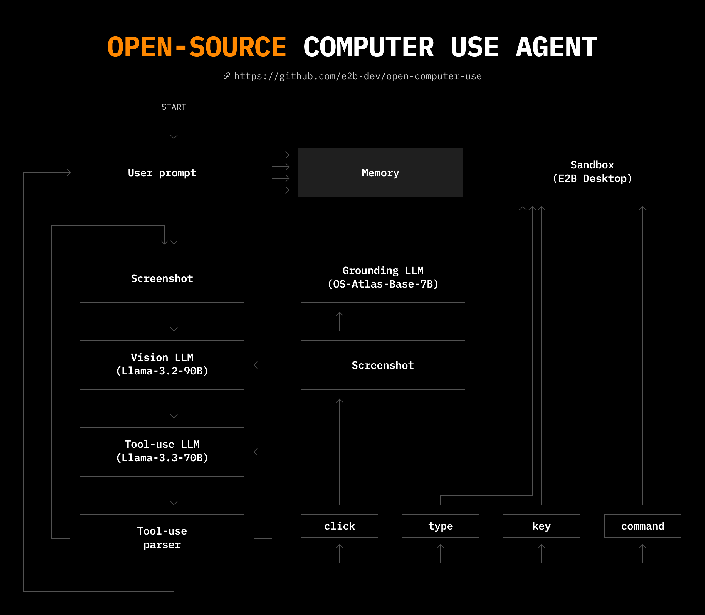

# Open Computer Use

A secure cloud Linux computer powered by [E2B Desktop Sandbox](https://github.com/e2b-dev/desktop/) and controlled by open-source LLMs.

https://github.com/user-attachments/assets/3837c4f6-45cb-43f2-9d51-a45f742424d4

## Features

- Uses [E2B](https://e2b.dev) for secure [Desktop Sandbox](https://github.com/e2b-dev/desktop)
- Uses [Llama 3.2](https://www.llama.com/docs/model-cards-and-prompt-formats/llama3_2), [3.3](https://www.llama.com/docs/model-cards-and-prompt-formats/llama3_3/) and [OS-Atlas](https://osatlas.github.io/)
- Operates the computer via a combination of keyboard, mouse, and shell commands
- Live streams the display of the sandbox on the client computer
- The user can pause the agent and provide feedback and any time
- Designed to work on any operating system or platform
- Supports a number of inference providers, including Hugging Face, Fireworks, OpenRouter, etc.

## Design



The details of the design are laid out in this article: [How I taught an AI to use a computer](https://blog.jamesmurdza.com/how-i-taught-an-ai-to-use-a-computer)

## Get started

### Prerequisites

- Python 3.10 or later
- [git](https://git-scm.com/)
- [E2B API key](https://e2b.dev/dashboard?tab=keys)
- [Fireworks API key](https://fireworks.ai/account/api-keys)

### 1. Install the prerequisites

In your terminal:

```sh
brew install poetry ffmpeg
```

### 2. Clone the repository

In your terminal:

```sh
git clone https://github.com/e2b-dev/open-computer-use/
```

### 3. Set the environment variables

Enter the project directory:

```
cd open-computer-use
```

Create a `.env` file in `open-computer-use` and set the following:

```sh
# Get your API key here - https://e2b.dev/
E2B_API_KEY="your-e2b-api-key"
FIREWORKS_API_KEY="your-fireworks-api-key"
```

### 4. Start the web interface

Run the following command to start the agent:

```sh
poetry install
```

```sh
poetry run start
```

The agent will start and prompt you for its first instruction.

## LLM support

Open Computer Use supports a variety of LLMs and LLM providers, which are defined in `models.py`.

The following lines of code can be changed to any valid combination of model and provide, so long as the new vision model supports vision input and the new action model supports tool use.

```
vision_model = FireworksProvider(model_names["fireworks"]["llama3.2"])
action_model = FireworksProvider(model_names["fireworks"]["llama3.3"])
```

If you add models or define a new provider, feel free to make a PR to this repository.